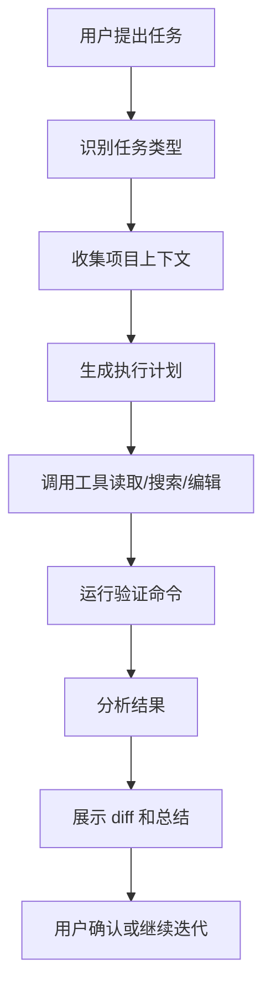
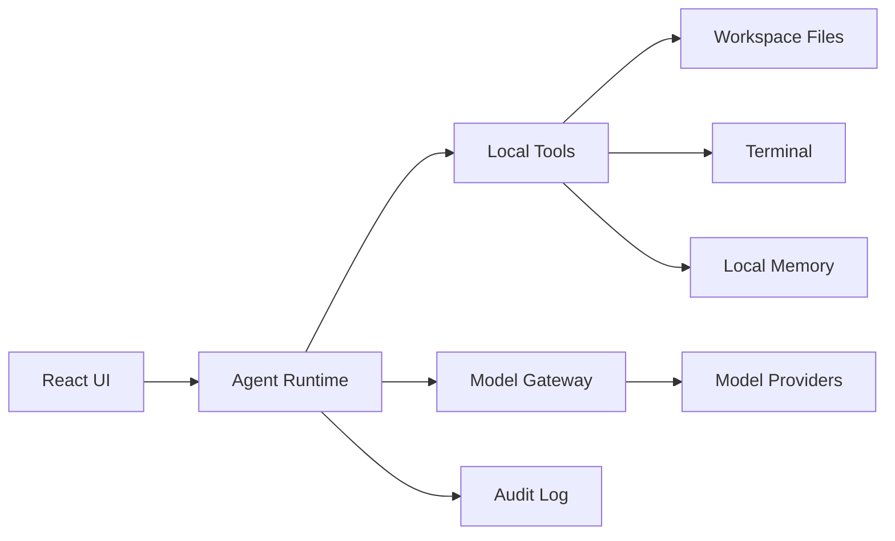

# CodeDT 产品设计文档 v0.1

## 1. 项目概述

CodeDT 是一款面向开发者、设计型创作者和独立产品构建者的本地 AI 编程工作台。它以 DeepSeek V4 为主要模型能力，同时支持第三方模型接入，通过项目理解、代码编辑、命令执行、测试验证、变更审查和工作流自动化，把用户的自然语言想法转化为可验证、可追踪、可迭代的工程结果。

CodeDT 的目标不是做一个普通聊天壳，也不是只做一个 IDE 插件，而是成为一个可协作的本地开发伙伴：能理解项目上下文，能动手修改代码，能解释自己的操作，能在安全边界内持续推进任务。

### 1.1 名称含义

CodeDT 中的 `T` 可以承载项目的核心理念：

- `Think`：先理解项目和意图，再行动。
- `Tool`：AI 不止回答问题，还能使用工具完成任务。
- `Trace`：所有关键操作可追踪、可审查、可回滚。
- `Team`：像一个长期协作的开发搭档。
- `Transform`：把想法、设计和需求转化为代码与产品。

### 1.2 一句话定位

CodeDT 是一个 DeepSeek 优先、多模型兼容、面向真实项目开发的本地 AI Agent 编程工作台。

## 2. 产品目标

### 2.1 核心目标

- 让用户用自然语言驱动真实项目开发。
- 让 AI 能读项目、搜代码、改文件、跑命令、验证结果。
- 让所有文件修改和命令执行都在用户可理解、可确认的边界内发生。
- 让 DeepSeek V4 成为默认且优化最好的主力模型。
- 让第三方模型以统一 Provider 机制接入，避免被单一模型绑定。

### 2.2 非目标

v0.1 阶段暂不追求以下目标：

- 不做完整云端协作平台。
- 不做复杂团队权限系统。
- 不做插件市场。
- 不做从零替代 VS Code 的完整 IDE。
- 不做自动无确认的大规模代码重写。

CodeDT 第一阶段应该专注于一个可靠闭环：理解需求，修改代码，验证结果，展示变更。

## 3. 目标用户

### 3.1 主要用户

- 独立开发者：需要快速把想法变成可运行项目。
- 前端工程师：需要 AI 协助实现 UI、交互、修复样式和验证页面。
- 全栈工程师：需要 AI 协助跨前后端理解项目、补功能、修 bug。
- 产品型开发者：既关心产品体验，也关心工程落地。
- 中文开发者：希望 AI 工具更理解中文表达、中文开发习惯和国内模型生态。

### 3.2 典型使用场景

- 在现有项目中新增功能。
- 根据报错日志定位并修复 bug。
- 让 AI 阅读代码后解释模块结构。
- 生成或补充测试。
- 审查本地改动并给出风险提示。
- 根据截图或描述优化前端界面。
- 生成 README、接口文档、提交信息或 PR 描述。
- 将一个模糊产品想法拆成可执行开发计划。

## 4. 产品原则

### 4.1 本地优先

项目文件、命令执行、工作区状态优先保留在用户本地。CodeDT 默认只访问用户显式打开的项目目录。

### 4.2 DeepSeek 优先，多模型开放

DeepSeek V4 是默认主模型，但架构上不把业务逻辑绑定到 DeepSeek。所有模型都通过统一 Provider 接口接入。

### 4.3 先理解，再执行

CodeDT 在执行任务前应尽量读取必要上下文，包括文件结构、相关代码、已有脚本、测试方式和项目约定。

### 4.4 变更可见

任何文件修改都应该能以 diff 形式展示。用户应能清楚知道 AI 改了什么、为什么改、如何验证。

### 4.5 权限明确

文件写入、命令执行、依赖安装、删除操作、Git 危险操作、网络访问等能力都需要分层授权。

### 4.6 工作流驱动

CodeDT 不只是聊天，而是提供不同工作模式：功能开发、Bug 修复、代码审查、前端设计、文档生成、测试补全等。

## 5. MVP 范围

### 5.1 MVP 核心闭环

MVP 必须跑通以下流程：

1. 用户打开本地项目。
2. 用户用自然语言描述任务。
3. CodeDT 搜索并读取相关文件。
4. CodeDT 给出简短执行计划。
5. CodeDT 修改文件。
6. CodeDT 运行验证命令或提示用户选择验证方式。
7. CodeDT 展示变更 diff 和验证结果。
8. 用户确认、继续迭代或回退。

### 5.2 MVP 功能清单

- 项目打开与工作区管理。
- 文件树浏览。
- 聊天任务面板。
- 本地文件读取和搜索。
- 文件编辑与 patch 应用。
- Diff 预览。
- 内置终端或命令执行面板。
- DeepSeek API Key 配置。
- OpenAI-compatible API 配置。
- 模型流式输出。
- 基础工具调用：读文件、列目录、搜索、写文件、运行命令。
- 操作日志。
- 任务结果总结。

### 5.3 MVP 暂缓功能

- 多 Agent 并行。
- 云同步。
- 用户账号系统。
- 插件市场。
- 团队协作。
- 长期自动化任务。
- 完整视觉模型链路。
- 完整 MCP 市场生态。

## 6. 信息架构与界面布局

### 6.1 主界面布局

建议第一版采用三栏布局：

- 左侧：项目区
  - 项目名称
  - 文件树
  - 搜索入口
  - Git 状态摘要

- 中间：任务区
  - 对话流
  - 当前任务状态
  - 工具调用过程
  - 用户输入框
  - 模式切换

- 右侧：审查区
  - 当前文件预览
  - Diff 视图
  - 命令输出
  - 测试结果
  - 操作日志

### 6.2 核心模式

- `Ask`：问答和代码解释。
- `Build`：新增功能或实现需求。
- `Fix`：根据错误、日志、测试失败修复问题。
- `Review`：审查代码改动，指出风险。
- `Design`：前端 UI、交互和产品体验建议。
- `Docs`：生成文档、README、注释、变更说明。

### 6.3 用户体验要求

- 用户始终知道当前 AI 在做什么。
- 工具调用过程要简洁可折叠。
- 关键风险需要明确提示。
- Diff 应该是高频核心界面，而不是隐藏功能。
- 命令输出需要保留原始信息，也需要有 AI 摘要。
- 输入框要支持引用文件、文件夹、终端输出和截图。

## 7. Agent 工作流

### 7.1 基础执行流程



### 7.2 Agent 状态

- `Idle`：等待用户输入。
- `Planning`：理解任务并形成计划。
- `Reading`：读取文件和项目上下文。
- `Editing`：生成并应用变更。
- `Running`：执行命令或测试。
- `Reviewing`：检查结果和 diff。
- `WaitingForUser`：等待用户授权或选择。
- `Completed`：任务完成。
- `Failed`：任务失败并给出原因。

### 7.3 工具调用规范

每次工具调用都应包含：

- 工具名称。
- 调用目的。
- 目标文件或命令。
- 执行结果摘要。
- 是否影响本地文件。
- 是否需要用户确认。

## 8. 模型接入设计

### 8.1 Provider 抽象

模型接入层需要独立于 UI 和 Agent 业务逻辑。

```ts
export interface ModelProvider {
  id: string
  name: string
  capabilities: ModelCapability[]
  chat(request: ChatRequest): Promise<ChatResponse>
  stream(request: ChatRequest): AsyncIterable<ChatChunk>
}
```

### 8.2 模型能力分类

- `chat`：普通对话。
- `code`：代码生成和修改。
- `reasoning`：复杂推理和规划。
- `toolUse`：工具调用。
- `vision`：图片理解。
- `longContext`：长上下文处理。
- `embedding`：向量索引。

### 8.3 首批模型 Provider

- DeepSeek Provider。
- OpenAI-compatible Provider。
- OpenAI Provider。
- Anthropic Provider。
- Gemini Provider。
- Local Model Provider。

### 8.4 模型路由建议

- 默认任务：DeepSeek V4。
- 代码修改：DeepSeek V4 或专门代码模型。
- 长文档理解：长上下文模型。
- 截图分析：视觉模型。
- 快速摘要：低成本快速模型。
- 复杂架构讨论：推理模型。

## 9. 上下文管理

### 9.1 上下文来源

- 当前对话。
- 用户显式引用的文件。
- 当前打开文件。
- 搜索到的相关代码。
- 项目结构。
- package scripts、测试脚本和配置文件。
- Git diff。
- 终端输出。
- 项目记忆。

### 9.2 上下文策略

- 优先读取相关文件，而不是把整个项目塞进上下文。
- 对大文件进行结构化摘要。
- 对长期信息写入项目记忆，如技术栈、启动命令、测试命令。
- 对任务过程进行阶段性压缩。
- 保留关键决策、失败原因和验证方式。

### 9.3 项目记忆

项目记忆建议保存在本地，例如 `.codedt/memory.json` 或本地 SQLite 中。内容包括：

- 项目技术栈。
- 常用命令。
- 测试方式。
- 代码风格。
- 用户偏好。
- 已知注意事项。

## 10. 权限与安全

### 10.1 文件权限

- 默认只能读取用户打开的项目目录。
- 写入操作默认限制在工作区内。
- 删除文件需要用户确认。
- 大规模修改需要二次确认。
- 修改敏感文件需要提示，例如 `.env`、密钥文件、部署配置。

### 10.2 命令权限

命令分为三类：

- 低风险：读取状态类命令，如 `git status`、`npm test`、`ls`。
- 中风险：安装依赖、启动服务、格式化代码。
- 高风险：删除文件、重置 Git、清理目录、修改系统配置。

中高风险命令需要显式授权。高风险命令应默认阻止，除非用户明确确认。

### 10.3 密钥安全

- API Key 本地加密保存。
- 不把密钥写入日志。
- 不把密钥发送给模型。
- 检测到密钥出现在上下文中时进行脱敏。

### 10.4 审计日志

CodeDT 应保留任务级审计日志：

- 用户请求。
- 模型选择。
- 工具调用。
- 文件变更。
- 命令执行。
- 验证结果。
- 用户授权记录。

## 11. 技术架构建议

### 11.1 首选技术栈

- 桌面框架：Electron。
- 前端：React + TypeScript + Vite。
- UI：Tailwind CSS + Radix UI 或 shadcn/ui。
- 编辑器：Monaco Editor。
- Diff：Monaco Diff Editor 或成熟 diff 组件。
- 本地命令：node-pty。
- 文件搜索：ripgrep。
- 数据存储：SQLite。
- 配置存储：本地加密配置文件。

选择 Electron 的原因是 AI 编程工作台需要深度依赖 Node 生态、本地文件系统、终端、PTY、开发工具链和跨平台能力，第一版用 Electron 更利于快速完成闭环。

### 11.1.1 已确认技术决策

第一版 CodeDT 确定采用以下产品与技术决策：

- 桌面框架使用 `Electron`，优先保证本地工程能力、Node 生态兼容性和开发速度。
- 文件修改默认采用 `diff 预览 -> 用户确认 -> 应用变更` 的流程，先建立信任和可追踪性。
- MVP 阶段内置轻量浏览器预览，用于打开本地 `localhost` 页面，支撑前端开发和后续视觉验证闭环。

这些决策会作为 v0.2 项目骨架设计的基础。

### 11.2 模块划分

- `app-shell`：桌面窗口、菜单、生命周期。
- `ui`：前端界面组件。
- `workspace`：项目打开、文件树、文件读写。
- `agent-runtime`：Agent 状态机、工具调度、任务执行。
- `model-gateway`：模型 Provider 和路由。
- `terminal`：命令执行和 PTY。
- `diff-engine`：变更生成、预览、应用、回退。
- `memory`：项目记忆和会话压缩。
- `security`：权限、授权、脱敏、审计。
- `settings`：模型配置、用户偏好、主题。

### 11.3 数据流



## 12. 数据结构草案

### 12.1 任务

```ts
interface AgentTask {
  id: string
  workspaceId: string
  mode: "ask" | "build" | "fix" | "review" | "design" | "docs"
  status: AgentTaskStatus
  userRequest: string
  createdAt: string
  updatedAt: string
  modelId: string
  steps: AgentStep[]
}
```

### 12.2 工具调用

```ts
interface ToolCallRecord {
  id: string
  taskId: string
  toolName: string
  purpose: string
  inputSummary: string
  outputSummary: string
  riskLevel: "low" | "medium" | "high"
  status: "pending" | "running" | "completed" | "failed" | "blocked"
  createdAt: string
}
```

### 12.3 模型配置

```ts
interface ModelConfig {
  id: string
  providerId: string
  displayName: string
  baseUrl?: string
  apiKeyRef: string
  defaultFor?: AgentMode[]
  capabilities: ModelCapability[]
}
```

## 13. 路线图

### 13.1 v0.1：设计与架构确认

- 完成产品设计文档。
- 明确 MVP 范围。
- 明确技术栈。
- 明确核心模块边界。
- 确定第一版 UI 布局。

### 13.2 v0.2：项目骨架

- 初始化 Electron + React + TypeScript + Vite 项目。
- 建立基础窗口和主界面布局。
- 建立设置页和模型配置页面。
- 建立本地工作区打开能力。
- 建立基础文件树。

### 13.3 v0.3：模型与对话

- 接入 DeepSeek Provider。
- 接入 OpenAI-compatible Provider。
- 支持流式对话。
- 支持会话持久化。
- 支持引用文件进入上下文。

### 13.4 v0.4：Agent 工具闭环

- 支持文件读取、搜索、编辑。
- 支持 patch 应用。
- 支持 diff 展示。
- 支持命令执行。
- 支持工具调用日志。

### 13.5 v0.5：开发任务闭环

- 实现 Build/Fix/Review 模式。
- 支持运行测试并分析结果。
- 支持任务总结。
- 支持用户确认后应用变更。
- 支持基础项目记忆。

### 13.6 v1.0：可日常使用

- 完善权限系统。
- 完善多模型路由。
- 完善前端设计工作流。
- 支持截图理解。
- 支持长期项目记忆。
- 支持插件或 MCP 基础接入。

## 14. 关键风险

### 14.1 模型工具调用稳定性

不同模型对工具调用、结构化输出和长上下文的稳定性不同。需要在 Agent Runtime 层做容错、重试、输出解析和降级策略。

### 14.2 本地命令安全

AI 编程工具的最大风险之一是命令执行。需要从第一版就建立风险分类、授权提示和审计日志。

### 14.3 上下文膨胀

项目文件过多时，盲目塞上下文会导致成本高、速度慢、回答不稳定。必须优先做搜索、摘要和项目记忆。

### 14.4 体验复杂度

Agent 工具链容易让界面变复杂。UI 应该把高频信息放出来，把细节折叠起来，让用户既能信任过程，也不会被日志淹没。

### 14.5 过早扩展

多 Agent、插件市场、云同步都很诱人，但第一阶段不应抢 MVP 的注意力。先把单 Agent 本地开发闭环做稳。

## 15. 下一步行动

建议接下来按以下顺序推进：

1. 基于本文档确认 MVP 范围和技术栈。
2. 绘制第一版 UI 线框图。
3. 设计 Agent Runtime 的状态机和工具接口。
4. 设计 Model Provider 接口。
5. 初始化项目骨架。
6. 先接入 DeepSeek 对话和项目文件读取。
7. 再实现编辑、diff 和命令执行闭环。

## 16. 待讨论问题

- DeepSeek V4 的具体 API 形态是否采用 OpenAI-compatible 协议优先？
- 命令执行是集成完整 PTY，还是先做一次性命令执行？
- 项目记忆先使用 SQLite，还是先使用简单 JSON 文件？
- 是否需要从 v0.2 开始就支持 MCP？

## 17. 已确认决策记录

### 17.1 桌面框架

结论：第一版使用 Electron。

原因：

- Electron 对本地文件系统、Node 工具链、终端、PTY、开发服务器和跨平台能力支持成熟。
- CodeDT 第一阶段最重要的是快速跑通 AI 编程工作台闭环。
- Tauri 可以作为后续体积和性能优化方向，但不作为 MVP 首选。

### 17.2 文件修改策略

结论：默认生成 diff，并由用户确认后应用。

原因：

- CodeDT 需要建立用户对 AI 修改本地项目的信任。
- diff 是 AI 编程工作台的核心交互，不应隐藏。
- 后续可以增加低风险自动应用选项，但 MVP 阶段不默认开启。

### 17.3 前端预览

结论：MVP 内置轻量浏览器预览。

原因：

- CodeDT 的差异化包括代码与设计体验结合。
- 前端页面预览能为 UI 修改、交互验证和后续截图分析提供基础。
- MVP 阶段只需要支持打开本地 `localhost` 地址，不必先实现复杂自动识别。
